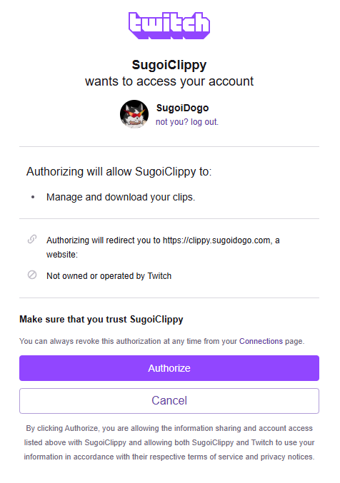

# Twitch Clips Consent API
This is a Cloudflare Worker that can be deployed completely for free (up to 100k requests per day) to allow clip players to gain access to mp4 urls by acting as a middleman for the [Get Clips Download](https://dev.twitch.tv/docs/api/reference/#get-clips-download) API.

## Usage

At the time of writing, the button below will prompt you for everything required except for the subdomain to assign the worker to and the `CLIENT_SECRET` variable, which must be added as a secret to your worker, not as a standard environment variable. You should use the same client id and secret as the clip player that will be using this api.

[](https://deploy.workers.cloudflare.com/?url=https%3A%2F%2Fgithub.com%2Fsugoidogo%2Ftwitch-clips-consent-api)

### `/consent`
Before requesting a clip download, the broadcaster must authorize your client to download their clips, which is done via the `/consent` endpoint. For example, Clippy (the clip player this was developed for) will send a chat message with the link https://clippy.sugoidogo.com/consent, which then redirects the broadcaster to a page like the following:

<details><summary>Image</summary>

</details>

Once they click Authorize, they are redirected back to the `/consent` endpoint with an authorization code, which this API consumes and exchanges for a refresh token that is stored server-side for future requests, and a message is shown to the user informing them that they can leave the page. You will need to add the consent endpoint url to your OAuth redirect urls in the [Twitch Developer Console](https://dev.twitch.tv/console).

### `/clip`

This endpoint requires the same Authorization header as the official Twitch API, with an access token matching the client ID this API was deployed with. It takes two query parameters:

`broadcaster_id`: the id of the broadcaster who owns the clip you want to download

`clip_id`: the id of the clip you want to download

A typical request could look like this: `/clips?broadcaster_id=123456&clip_id=YourMomStinks-asdfghjkl`

If the broadcaster hasn't previously authorized this client, you'll get a response like this:

```json
{
    "auth_uri":"https://clippy.sugoidogo.com/consent",
    "error":"missing broadcaster authorization"
}
```

Otherwise, the request is passed to the Twitch API and the response is the same as the [Get Clips Download](https://dev.twitch.tv/docs/api/reference/#get-clips-download) endpoint.